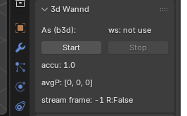

# blender3dWannd

3d Wannd is a 3d mesuring mouse to be able to enter x,y,z POI in blender as a UI panel

#### for what it is

To trace dificult shaps / mesurmants. It use computer vision powertd by:
- opencv
- python
- viteyss-site-dziabong-harvester
- viteyss-site-3dWannd

#### setup

To set it up you need runing **viteyss-site-dziabong-harvester**

* Drawing in blender
    - load `3dwannd.py` to editor and run it
    - this will add section `3d Wannd` in Ui Scene
     

    - `Start` look for ws status information `ws: ok`

* Observator
    Camera / phone on trepod, not moving. Looking by front or back camera. It need to see **viteyss-site-3dWannd**
    This need to have target CID to `b3d` so Media will be stream to our 3d Wannd in blender.
    `Start stream`
    At this moment you will see update on frame No and other info in blender Ui Panel

* 3dWannd
    - phone with web browser on this site so `https://localhost:8081/yss/index.html#pageByName=3d%20Wannd`
    - select marker to show and show it on screen to `Observator`
    - position phone to `POI` click button `setPOI`

        

